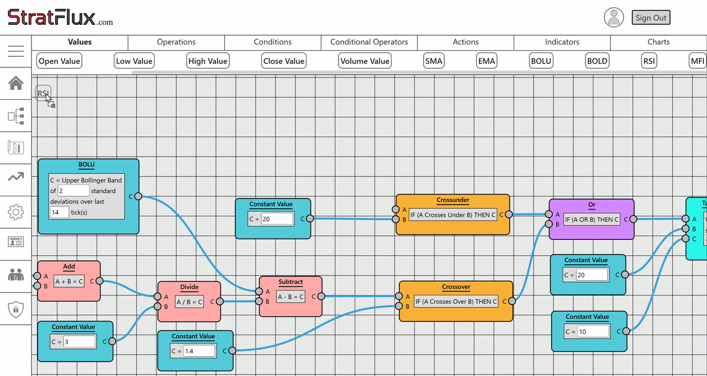
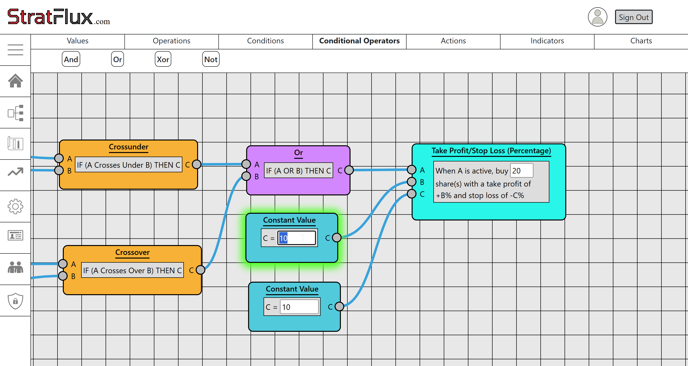
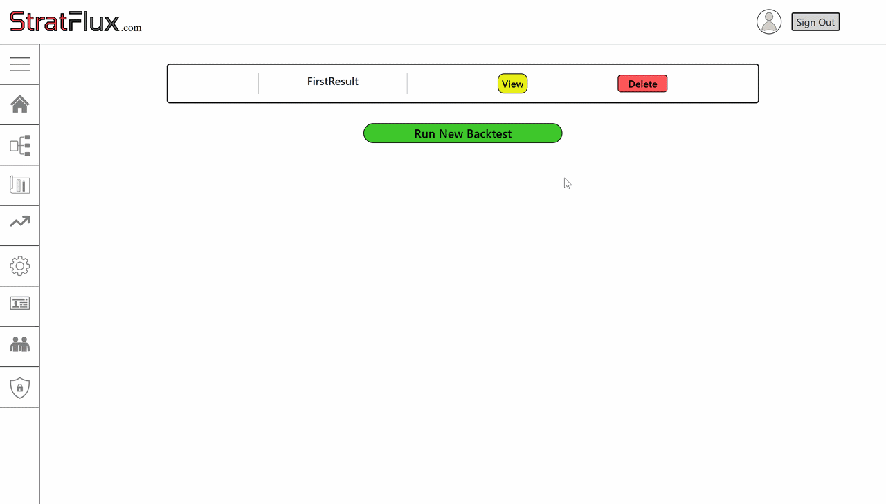
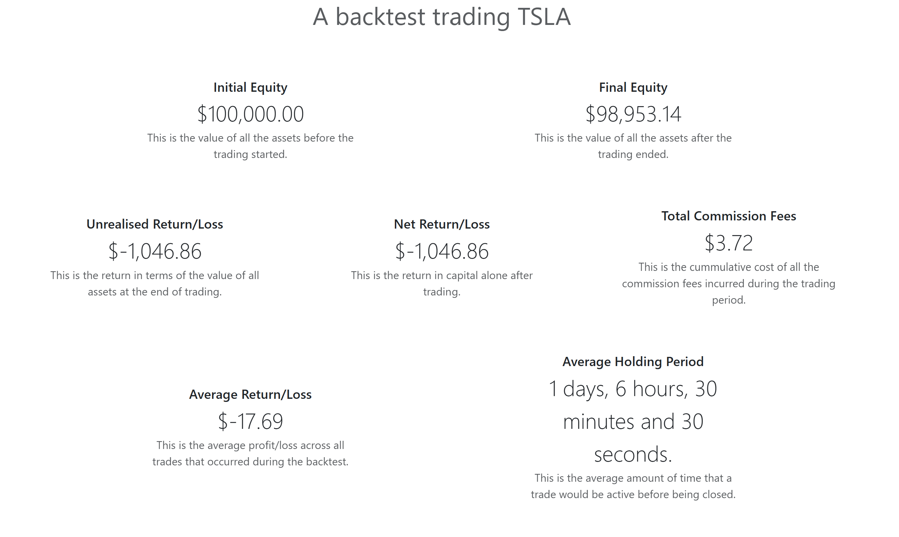

# StratFlux



StratFlux is an Algorithmic Trading Strategy Builder and Backtesting Engine, created as part of my **A-Level Computer Science Non-Exam Assessment (NEA)**.

The web application empowers users to design custom trading strategies using an intuitive, drag-and-drop visual node editor without writing a single line of code. Users can then backtest these strategies against real historical market data to evaluate their viability and optimize parameters before putting real capital at risk.


## Key Features


- **Visual Strategy Editor:** A powerful drag-and-drop node interface (powered by *Drawflow*) mimicking logic gates, indicators (SMA, EMA, RSI, etc.), and mathematical conditionals. Users can seamlessly connect nodes to build complex entry and exit trading conditions.

    

- **Custom Backtesting Engine:** Evaluates user-created node networks against historical OHLCV data to simulate real-world trading performance, notifying user of results via SignalR.

    

- **Detailed Analytics:** Creates backtest reports including Max Drawdown, Win/Loss Ratio, Net Returns, Commission Fees, and Average Holding Periods.

    

- **Live Market Data Integration:** Connects with the **Alpaca Markets API** for accurate and high-fidelity paper/historical stock data retrieval.

- **User Authentication:** Secure user identity structure managing personal strategies, historical backtests, user profiles, and backtesting settings.


## Technology Stack


**Backend:**

- C# / .NET 6.0

- ASP.NET Core MVC Web Application

- Entity Framework Core (Code-First Migrations)

- SignalR (Real-time web functionality)

- ASP.NET Core Identity


**Frontend:**

- HTML5 / CSS3 / JavaScript

- Razor Views (`.cshtml`)

- Bootstrap

- Drawflow (Interactive node-based visual logic builder)


**Database & Infrastructure:**

- PostgreSQL (via Npgsql)

- Alpaca API (Market Data Provider)


## Setup & Installation


To run this project locally, follow these steps:


### Prerequisites:

- [.NET 6.0 SDK](https://dotnet.microsoft.com/download/dotnet/6.0)

- [PostgreSQL](https://www.postgresql.org/download/)

- An [Alpaca Markets Account](https://alpaca.markets/) (for an API Key and Secret Key)

For the below setup, I am assuming you are using Visual Studio Community Edition.

### 1. Clone the Repository
1. Open Visual Studio Community.
2. Select **Clone a repository** from the start window.
3. Enter the repository URL
4. Choose your local path and click **Clone**.

### 2. Configure Database & API Keys (User Secrets)
For security, this project uses the .NET Secret Manager to store database credentials and Alpaca API keys outside of the source code tree.

1. Open the solution in Visual Studio.
2. In the **Solution Explorer**, right-click the `StratFlux` project node and select **Manage User Secrets**.
3. A `secrets.json` file will open. Replace its contents with the following template, filling in your own PostgreSQL password and Alpaca credentials:

```json
{
  "ConnectionStrings": {
    "PostgresConnection": "Host=localhost;Database=StratFlux;Username=postgres;Password=YOUR_POSTGRES_PASSWORD"
  },
  "AlpacaKeys": {
    "ApiKey": "YOUR_ALPACA_API_KEY",
    "SecretKey": "YOUR_ALPACA_SECRET_KEY"
  }
}
```

*Note: Ensure you have created a blank database named `StratFlux` in your local PostgreSQL server before proceeding.*

### 3. Apply Database Migrations
This project uses Entity Framework Core Code-First migrations to build the database schema.

1. In Visual Studio, go to **Tools** > **NuGet Package Manager** > **Package Manager Console**.
2. Run the following command to generate the tables in your PostgreSQL database:
   ```powershell
   Update-Database
   ```

### 4. Run the Application
Press `F5` or click the Start button at the top of Visual Studio to launch the application in your default browser.

## About the A-Level NEA

This application was researched, designed, implemented, tested, and evaluated from scratch as a submission for my A-Level Computer Science Coursework (NEA).

Here you can find the video I submitted for the testing section. It may be useful if you want to see the functionality of this application without installing it on your own machine:

<a href="https://youtu.be/NECc2XUvnOo">
  
</a>

## Licence
This project is open-source and available under the [MIT Licence](LICENSE). 
It was developed purely for educational purposes as an A-Level NEA submission. You are welcome to explore, fork, and learn from the codebase!
